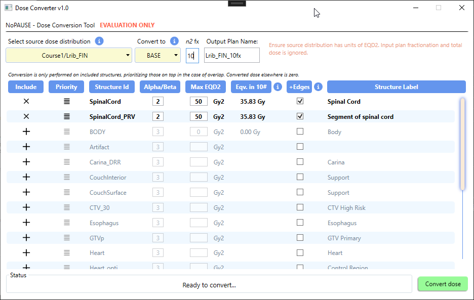

# EQD2/BED/BASE Dose Converter
This Varian ESAPI script provides various options related to conversion to and from BED and EQD2 dose formats, as well as producing base dose plans for optimization of re-treatments. This project is a fork of the original EQD2 Converter by brjdennis (https://github.com/brjdenis/VarianESAPI-EQD2Converter)



## Setup

To use the script, you must compile it on your system. You should be able to open the project with Visual Studio 2022 Community Edition. Open the .sln file. 
The script was developed for Eclipse version 15.6. It may not work with other versions of Eclipse or Varian ESAPI.

1. You will need to restore all NuGet packages for compilation. This may require cleaning the solution and restarting.
2. You may need to relink references to the Varian dlls.
3. Compile as Release for x64.

## How to use the script

Before your first run:

1. Review the DoseConverterConfig.xml file in the Configuration folder, and add any default assignments of alpha/beta that are appropriate for your institution.
2. Approve the script in Eclipse (it is a write-enabled script)

To run the script:

1. Launch the script with a plan in context. The plan must have a defined distribution, total dose, fractions, and treatment percentage
2. The script GUI will launch and the structures in the in-context plan structure set will populate. Default alpha-beta ratios and edge-conversion settings will be applied.
3. If necessary, change the source distribution, for example to a plan-sum if needed. Only sums with the same primary structure set as the in-context plan are shown.
4. Select an output format. The options are described in the online help that can be accessed by clicking the info button next to the pull-down menu. Note that some options require the input distribution to be in EQD2 format already.
5. If necessary, select the number of fractions to output the distribution to ("n2" fractions).
6. Confirm the output verification plan name.
7. Review the alpha-beta ratios and options for the structures being converted. Use the "+" and "x" buttons to toggle whether structures are included. The +Edges option will also include the voxels immediately adjacent to the structure. Dose will be set to zero outside of selected structures, so if the full distribution is desired, ensure that the external/Body contour is included. Where structures overlap, priority is given to the higher structure in the list. The list icon in the Priority column can be dragged up and down to change the order or the included structures.

## Details

1. The calculation is performed with the well known formulas: EQD2 = D ( a/b + D/n) / (a/b + 2) and BED = D (1 + D / ( n a/b)). The third option, BEDn2, transforms the source dose distribution from the input fractionation to the selected output fractionation such that each distribution is BED equivalent. The fourth option, BASE, calculates a base dose distribution designed to be used as a base dose for re-treatment optimization. The base dose is determined so that when optimization is performed, each structure will not exceed its specified Max EQD2 if the optimization does not exceed the equivalent dose in n2 fractions. This is displayed for each structure for the convenience of the user.
3. The accuracy of conversion equals the width of the dose matrix box. Do some testing to see how it works.
4. The determination of which voxels lie within structures is done only in the X direction.
5. If you need better accuracy, calculate the original plan with smaller dose box width.
6. The conversion should (only) work for HFS, HFP, FFS, FFP orientations. If you are summing up plans based on different registered images, the result may be wrong. I haven't had time to test this.

## Important note

Like the original repository from which this is forked (https://github.com/brjdenis/VarianESAPI-EQD2Converter/blob/master/LICENSE), this program is distributed under the MIT license [licence].

**This program comes with absolutely no guarantees of any kind.**

```
THE SOFTWARE IS PROVIDED "AS IS", WITHOUT WARRANTY OF ANY KIND, EXPRESS OR
IMPLIED, INCLUDING BUT NOT LIMITED TO THE WARRANTIES OF MERCHANTABILITY,
FITNESS FOR A PARTICULAR PURPOSE AND NONINFRINGEMENT. IN NO EVENT SHALL THE
AUTHORS OR COPYRIGHT HOLDERS BE LIABLE FOR ANY CLAIM, DAMAGES OR OTHER
LIABILITY, WHETHER IN AN ACTION OF CONTRACT, TORT OR OTHERWISE, ARISING FROM,
OUT OF OR IN CONNECTION WITH THE SOFTWARE OR THE USE OR OTHER DEALINGS IN THE
SOFTWARE.
```

## LICENSE

Published under the MIT license. 
